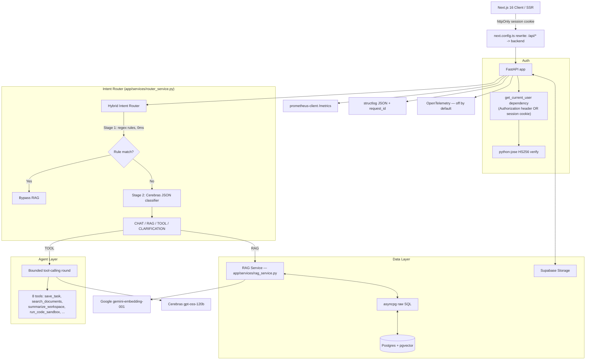

# Nexus AI — Architecture

Nexus AI is a multi-tenant RAG document assistant for M&A due diligence and financial audits. It's a two-service architecture: **Next.js 16** (frontend only) and a **Python FastAPI backend** (all business logic, auth, RAG, agentic workflow, and observability), sharing one Supabase Postgres + pgvector database.

This document covers architecture decisions and technical design. For an interview-oriented walkthrough (demo script, likely follow-up questions, what not to overclaim), see [`INTERVIEW_GUIDE.md`](./INTERVIEW_GUIDE.md).

---

## System Architecture



---

## Why This Split (Next.js frontend / FastAPI backend)

The original app was a Next.js monolith: App Router pages, API routes, and Prisma all in one process. The migration moved every piece of backend logic into FastAPI while keeping the frontend on Next.js, connected via a **same-origin rewrite proxy** rather than a cross-origin API call. That proxy decision is the architecturally interesting part and is worth explaining precisely:

- `next.config.ts` rewrites `/api/:path*` to the FastAPI backend's URL. From the browser's perspective, every request still goes to the Next.js origin.
- Auth uses an **httpOnly session cookie**, set by a two-line Next.js route (`app/auth/session/route.ts`) that does nothing but store the JWT the backend issued — no database access, no business logic. The browser attaches that cookie automatically to same-origin `/api/*` requests; Next.js's rewrite forwards it to FastAPI untouched.
- FastAPI's `get_current_user` dependency (`app/api/dependencies/auth.py`) accepts **either** an `Authorization: Bearer` header **or** the forwarded `session` cookie — so the backend works identically whether it's reached through the Next.js proxy (cookie) or hit directly (e.g. for testing, or a future non-browser client).
- **This was verified, not assumed**: before committing to the proxy approach, I tested SSE streaming through it directly, confirming chunks arrive incrementally (not buffered) — critical since the chat endpoint's whole UX depends on real token-by-token streaming.

The payoff: almost none of the existing React components needed to change, because they already called relative `fetch('/api/...')` paths — the plumbing underneath them changed, not their code.

---

## Multi-Tenant Data Isolation

Workspaces are isolated via indexed `workspaceId` foreign keys across `Document`, `DocumentChunk`, `Conversation`, `Task`, and `ToolExecution`. Critically, isolation is enforced **inside the SQL query itself**, not as a post-retrieval filter:

```python
await pool.fetch(
    """
    SELECT id, "documentId", content, metadata, embedding <-> $2::vector AS distance
    FROM "DocumentChunk"
    WHERE "workspaceId" = $1
    ORDER BY embedding <-> $2::vector
    LIMIT $3
    """,
    workspace_id, vector_literal, top_k,
)
```

This means a chunk from another workspace can never physically enter the candidate set — not "gets filtered out later," never retrieved at all. That distinction matters under prompt injection: even if a malicious prompt tries to convince the model to ask about another workspace's data, there's no code path where that data reaches the query result.

---

## Hybrid Intent Router

`app/services/router_service.py` — ports `lib/router.ts` with one correctness fix (see ADR table below).

| Route | Criteria | Example | Processing Path |
|---|---|---|---|
| `CHAT` | Greetings, general knowledge, coding help, pure math | *"hello"*, *"write a python function to reverse a string"* | Direct streaming LLM response, no RAG/embedding cost |
| `RAG` | Questions grounded in workspace documents | *"according to the contract, what's the termination clause?"* | Embed query → hybrid vector+keyword search → grounded prompt |
| `TOOL` | Task creation, workspace summarization | *"create a task to review the audit findings"* | Tool-calling round |
| `CLARIFICATION` | Ambiguous/incomplete input | *"check it"* | Model asks a clarifying question |

Stage 1 is zero-cost regex matching, handling the obvious majority of traffic without any network call. Stage 2 (reached only for ambiguous queries) calls Cerebras for a JSON-schema classification — see the ADR table for the token-budget bug this had and the fix.

---

## RAG Pipeline

`app/services/rag_service.py` — full detail in `INTERVIEW_GUIDE.md` §4. Summary: query-variant generation → parallel vector + keyword search → merge/dedupe → lexical rerank → (if empty) Levenshtein fuzzy fallback → neighbor-chunk expansion → MMR-like diversity selection → confidence scoring. Citation verification (`verify_citations`) runs after generation, scoring each response sentence's grounding via token-overlap against retrieved chunks.

---

## Agentic Workflow

`app/services/chat_service.py` + `app/agent/tools.py`. One bounded tool-calling round per chat turn (model → tool execution → follow-up synthesis stream), not a recursive ReAct loop — infinite-loop prevention by construction, not a step counter. 8 tools, each wrapped with `agent_tool_invocations_total` / `agent_tool_duration_seconds` metrics and a `ToolExecution` audit row. Full explanation in `INTERVIEW_GUIDE.md` §5.

---

## Observability

Three signals, wired together by a shared `request_id`:

- **Metrics** (`app/observability/metrics.py`): Prometheus counters/histograms for API requests, LLM calls (including real token counts when the provider returns them), RAG retrieval, agent runs/tools, and document ingestion. Labels are deliberately low-cardinality (route templates, not raw paths; bounded enums for status/tool/model).
- **Logs** (`app/core/logging.py`): `structlog` JSON, `request_id` bound via `contextvars` at the start of each request (`ObservabilityMiddleware`), returned as an `x-request-id` response header.
- **Traces** (`app/observability/tracing.py`): OpenTelemetry, off by default (`OTEL_ENABLED=false`, zero overhead). When enabled: incoming request (FastAPIInstrumentor), RAG retrieval, LLM calls, agent runs, and tool invocations each get a span.

`backend/observability/grafana-dashboard.json` is importable into any Prometheus-compatible Grafana instance (e.g. Grafana Cloud, since local Docker/Prometheus isn't used here) — five rows (API, LLM, RAG, agent, ingestion), every panel querying a metric that actually exists.

---

## Architectural Decision Records (ADRs)

| Decision | Option Selected | Rationale | Alternatives Considered |
|---|---|---|---|
| **Frontend/backend split** | Next.js (frontend-only) + FastAPI (all backend logic), connected via same-origin rewrite proxy + httpOnly cookie | Keeps existing React components almost entirely unchanged (no CORS/token-handling rewrite needed in ~10+ client components) while still cleanly separating frontend and backend deploys. Verified SSE streams correctly through the proxy before committing. | Cross-origin fetch + `Authorization: Bearer` header from every client component (more invasive, touches every fetch call site); keeping business logic in Next.js API routes (doesn't satisfy the Python/FastAPI requirement) |
| **Backend DB access** | `asyncpg` + raw SQL, no ORM | Needed exact fidelity to the existing Prisma-managed schema (including its quoted CamelCase identifiers) with zero migration. Raw SQL also made pgvector-specific operations (`<->`, `::vector`) direct instead of routed through an ORM abstraction. | SQLAlchemy + a schema-reflection layer, a second Prisma-adjacent Python ORM |
| **Embedding dimensionality bug fix** | Explicit `output_dimensionality=768` on the Google API call + one-off re-embedding migration script for existing chunks | Discovered the original code's 768-dim check always failed against Google's actual 3072-dim default response, meaning every stored embedding was a deterministic hash fallback, not real semantic data — verified against live production data (cosine similarity 0.9999999988 between a stored vector and the recomputed fallback). Fixing this was necessary for "vector search" to be a truthful claim. | Leaving the fallback behavior in place for 1:1 behavioral parity (rejected — it would mean shipping a system that silently never did real semantic search) |
| **Intent classifier token budget bug fix** | Raised `max_completion_tokens` from 60 to 400 | `gpt-oss-120b` is a reasoning model that spends completion tokens on an internal `reasoning` field before final `content`; 60 tokens was consumed entirely by reasoning for any non-trivial query, so the Stage-2 LLM classifier silently always fell through to its default. Confirmed via live API calls (60 tokens → empty content; 400 tokens → correct classification with real reasoning). | Switching to a non-reasoning model for classification (larger change, not necessary once the actual cause was found) |
| **Agent loop shape** | One bounded tool-calling round per chat turn, not a recursive ReAct loop | Matches what's actually implemented and needed for the current 8-tool set; infinite-loop prevention by construction rather than a step-counter guard. | A general step-limited agent loop (more complex, not justified by the current tool set — noted as a real "what I'd do differently" answer) |
| **LLM provider** | Cerebras Cloud (`gpt-oss-120b`) | Very fast token generation, native OpenAI-compatible function-calling schema, already integrated in the original app. | OpenAI, Anthropic |
| **Background document processing** | FastAPI `BackgroundTasks`, single path | The original app had both an Inngest event-queue send *and* a Next.js `after()` callback doing the same processing — the Inngest send was redundant since `after()` guaranteed execution. Consolidated to one path instead of carrying the duplication into the new backend. | Porting the Inngest queue too (rejected — redundant complexity) |
| **Document upload path** | Single multipart upload endpoint | The original app also had a presigned-URL direct-to-storage path, built specifically to dodge Vercel's ~4.5MB Next.js API route body limit. That limit doesn't apply to this standalone FastAPI service, so one upload path is sufficient. | Porting both upload paths (rejected — the constraint that motivated the second path no longer exists) |

---

## RAG Evaluation

`app/services/rag_eval.py` (ported from `lib/rag-eval.ts`) — Precision@K (relevant-chunk ratio in top-K), Mean Reciprocal Rank (1 / rank of first relevant chunk), confidence, and latency, computed against live retrieval for a configurable query set. Exposed at `POST /api/rag/eval` and the `/dashboard/[workspaceId]/eval` UI.
