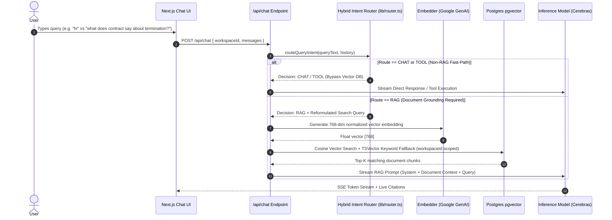

# Nexus AI — System Architecture & Engineering Deep-Dive

Nexus AI is an enterprise-grade multi-tenant RAG (Retrieval-Augmented Generation) document assistant built with **Next.js 16 (App Router)**, **PostgreSQL with `pgvector`**, **Cerebras Llama-3 / OSS LLMs**, **Google GenAI Embeddings**, and **Inngest** for background task execution.

---

## 🏗️ Agentic Intent Router & System Architecture

Rather than treating RAG as an unconditional overhead step for every user message, Nexus AI implements an **Agentic Intent Router** (`lib/router.ts`) that selectively routes queries before vector search occurs:

```mermaid
graph TD
    Client[Next.js 16 Client / UI] <--> AuthMiddleware[Edge Auth Middleware / Jose JWT]
    AuthMiddleware <--> NextServer[Next.js App Router API Routes]
    
    subgraph Intent Router Layer (lib/router.ts)
        NextServer --> Router[Hybrid Intent Router]
        Router -->|Stage 1: Rules| RuleMatch{Rule Match?}
        RuleMatch -->|Yes: Greetings / Math / Code / Tools| FastPath[Bypass RAG -> Direct LLM / Tool]
        RuleMatch -->|No: Ambiguous| LLMClass[Stage 2: Lightweight LLM Classifier]
        LLMClass -->|Route: CHAT| FastPath
        LLMClass -->|Route: RAG| RAGPipeline[Execute RAG Retrieval Pipeline]
        LLMClass -->|Route: TOOL| ToolExec[Execute Tool Handler]
    end

    subgraph Data & Storage Layer
        RAGPipeline <--> Prisma[Prisma ORM]
        Prisma <--> Postgres[(PostgreSQL + pgvector DB)]
        NextServer <--> SupabaseStorage[Supabase Object Storage]
    end

    subgraph RAG & AI Pipeline
        RAGPipeline <--> EmbeddingClient[Google GenAI - gemini-embedding-001]
        RAGPipeline <--> HybridSearch[pgvector Vector & TSVector Hybrid Search]
        RAGPipeline <--> CerebrasInference[Cerebras API - Streaming LLM + Function Calling]
    end

    subgraph Async Processing & Integrations
        NextServer <--> Inngest[Inngest Event Bus & Workers]
        Inngest --> DocProcessor[Doc Ingestion: PDF / DOCX / TXT Chunking]
        ToolExec --> Tools[Tool Execution: Tasks, Slack Webhooks, Reports]
    end
```

---

## 🛡️ Multi-Tenant Data Isolation Strategy

A primary requirement for enterprise RAG applications is preventing cross-tenant data leakage. In Nexus AI:

1. **Database Schema Partitioning**: Workspaces are isolated logically via indexed `workspaceId` foreign keys across `Document`, `DocumentChunk`, `Conversation`, `Task`, and `ToolExecution` tables.
2. **Hard-coded Query Boundaries**: Vector search queries do not rely solely on application-level filtering post-retrieval. Vector distance operations execute directly with strict `WHERE "workspaceId" = ${workspaceId}` clauses in Postgres SQL:

```sql
SELECT 
  id, "documentId", content, metadata,
  (embedding <-> ${vectorStr}::vector) AS distance
FROM "DocumentChunk"
WHERE "workspaceId" = ${workspaceId}
ORDER BY distance ASC
LIMIT ${topK};
```

This guarantees that even under arbitrary prompt injection, chunks from Workspace B can never physically enter the prompt context of Workspace A.

---

## ⚡ Agentic Intent Routing Sequence



### Intent Router Categories:

| Route | Criteria | Example User Query | Processing Path |
| :--- | :--- | :--- | :--- |
| **`CHAT`** | Greetings, general math, writing assistance, coding prompts | *"Hello"*, *"Write a python string reversal function"* | Direct Streaming LLM (Bypasses Vector Search & Embeddings) |
| **`RAG`** | Questions grounded in uploaded workspace documents | *"What is our refund policy in Q3?"* | Vector Embedding $\rightarrow$ pgvector Cosine Search $\rightarrow$ RAG Prompt |
| **`TOOL`** | Direct workspace actions or task triggers | *"Create a task to review budget"* | Fast-path to Tool Handler (`save_task`, `summarize_workspace`) |
| **`CLARIFICATION`** | Ambiguous or incomplete input | *"Check it"* | Prompt LLM for clarifying user input |

---

## 🏛️ Architectural Decision Records (ADRs)

| Decision | Option Selected | Rationale | Alternatives Considered |
| :--- | :--- | :--- | :--- |
| **Intent Orchestration** | Hybrid Router (Rules + Small LLM Classifier) | Rule-based interceptor handles 80% of obvious non-RAG queries in 0ms; lightweight LLM classifier handles ambiguous queries without wasting heavy embedding/vector search operations. | Unconditional RAG for all messages, Heavy LLM agentic loops |
| **Authentication System** | Custom JWT via `jose` & `bcryptjs` | Completely bypasses external provider rate limits (e.g. Supabase Auth 3 signups/hr limit on free tier) allowing unlimited E2E automated Playwright testing. | Supabase Auth, NextAuth / Auth.js |
| **Document Processing** | Next.js API Routes (`app/api/documents/upload/route.ts`) | Placing `pdf-parse` in Server Actions caused Webpack static analysis bundling failures with native Node C++ bindings (`fs` module resolution error). API routes execute natively in Node runtime without edge bundling restrictions. | Server Actions, Standalone Express Microservice |
| **LLM Inference Provider** | Cerebras Cloud (`gpt-oss-120b`) | Ultra-fast token generation speed (>1000 tokens/sec), zero per-token cost on open tier, native support for OpenAI-compatible function calling schemas. | OpenAI GPT-4o, Anthropic Claude 3.5 Sonnet |
| **Background Processing** | Inngest Event Queue | Serverless-friendly background worker runtime. Handles long-running multi-chunk embedding without HTTP timeout limitations. | BullMQ + Redis, Celery + Python |

---

## 📈 RAG Evaluation & Quality Benchmarking

Nexus AI includes a built-in evaluation harness (`lib/rag-eval.ts`) to programmatically measure retrieval quality:

- **Precision@K**: Percentage of top-K retrieved chunks containing relevant keywords/tokens.
- **Reciprocal Rank (RR)**: Measures how early the most relevant chunk appears in the retrieved result list.
- **Context Density**: Ratio of query-relevant terms relative to total context length.
- **RAG Confidence Score**: Normalized composite score balancing vector similarity distance and keyword match density.
