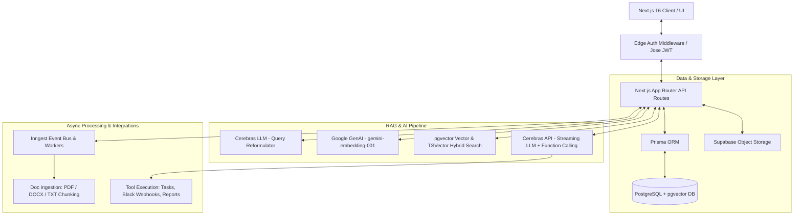
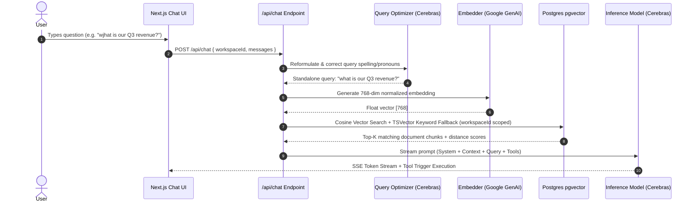

# Nexus AI — System Architecture & Engineering Deep-Dive

Nexus AI is an enterprise-grade multi-tenant RAG (Retrieval-Augmented Generation) document assistant built with **Next.js 16 (App Router)**, **PostgreSQL with `pgvector`**, **Cerebras Llama-3 / OSS LLMs**, **Google GenAI Embeddings**, and **Inngest** for background task execution.

---

## 🏗️ High-Level System Architecture



---

## 🛡️ Multi-Tenant Data Isolation Strategy

A primary requirement for enterprise RAG applications is preventing cross-tenant data leakage. In Nexus AI:

1. **Database Schema Partitioning**: Workspaces are isolated logically via indexed `workspaceId` foreign keys across `Document`, `DocumentChunk`, `Conversation`, `Task`, and `ToolExecution` tables.
2. **Hard-coded Query Boundaries**: Vector search queries do not rely solely on application-level filtering post-retrieval. Vector distance operations execute directly with strict `WHERE "workspaceId" = ${workspaceId}` clauses in Postgres SQL:

```sql
SELECT 
  id, "documentId", content, metadata,
  (embedding <-> ${vectorStr}::vector) AS distance
FROM "DocumentChunk"
WHERE "workspaceId" = ${workspaceId}
ORDER BY distance ASC
LIMIT ${topK};
```

This guarantees that even under arbitrary prompt injection, chunks from Workspace B can never physically enter the prompt context of Workspace A.

---

## ⚡ RAG Retrieval Engine & Optimization Pipeline



### Key RAG Innovations:
- **Conversational Query Reformulation**: Resolves ambiguous conversational pronouns (*"what did they say about it?"*) and corrects typos (*"wjhat"* -> *"what"*) using a lightweight pre-step LLM pass.
- **RAG Fast-Pathing**: Skips vector retrieval entirely for greetings, meta questions, and tool action commands to save embedding API costs and reduce end-to-end latency.
- **Hybrid Retrieval**: Combines semantic vector similarity with text matching and fuzzy Levenshtein token distance calculation for high recall.
- **Streaming Tool Executions**: Seamlessly handles LLM tool invocation (`save_task`, `summarize_workspace`, Slack integrations) using Server-Sent Events (SSE).

---

## 🏛️ Architectural Decision Records (ADRs)

| Decision | Option Selected | Rationale | Alternatives Considered |
| :--- | :--- | :--- | :--- |
| **Authentication System** | Custom JWT via `jose` & `bcryptjs` | Completely bypasses external provider rate limits (e.g. Supabase Auth 3 signups/hr limit on free tier) allowing unlimited E2E automated Playwright testing. | Supabase Auth, NextAuth / Auth.js |
| **Document Processing** | Next.js API Routes (`app/api/documents/upload/route.ts`) | Placing `pdf-parse` in Server Actions caused Webpack static analysis bundling failures with native Node C++ bindings (`fs` module resolution error). API routes execute natively in Node runtime without edge bundling restrictions. | Server Actions, Standalone Express Microservice |
| **LLM Inference Provider** | Cerebras Cloud (`gpt-oss-120b`) | Ultra-fast token generation speed (>1000 tokens/sec), zero per-token cost on open tier, native support for OpenAI-compatible function calling schemas. | OpenAI GPT-4o, Anthropic Claude 3.5 Sonnet |
| **Background Processing** | Inngest Event Queue | Serverless-friendly background worker runtime. Handles long-running multi-chunk embedding without HTTP timeout limitations. | BullMQ + Redis, Celery + Python |

---

## 📈 RAG Evaluation & Quality Benchmarking

Nexus AI includes a built-in evaluation harness (`lib/rag-eval.ts`) to programmatically measure retrieval quality:

- **Precision@K**: Percentage of top-K retrieved chunks containing relevant keywords/tokens.
- **Reciprocal Rank (RR)**: Measures how early the most relevant chunk appears in the retrieved result list.
- **Context Density**: Ratio of query-relevant terms relative to total context length.
- **RAG Confidence Score**: Normalized composite score balancing vector similarity distance and keyword match density.
