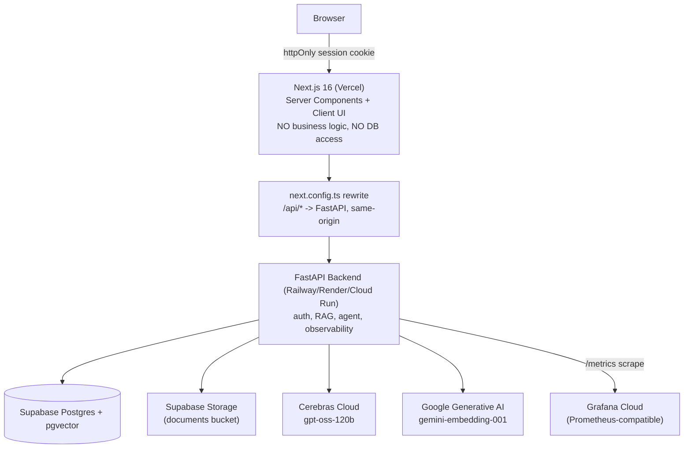

# Nexus AI — Interview Guide

This document is your prep sheet for walking through this project in a technical interview. Everything in it describes what is **actually implemented and verified working against the live database**, not aspirational architecture. Where something is a known limitation, it's called out explicitly in the [What Not To Claim](#what-not-to-claim) section at the bottom — read that section before the interview.

---

## 1. Project Overview (2-minute intro)

> "Nexus AI is a RAG-based document assistant for M&A due diligence and financial audits — think 'chat with your data room.' It started as a Next.js monolith (frontend + API routes + Prisma all in one app), and I migrated it into a two-service architecture: **Next.js as a pure frontend**, and a **Python FastAPI backend** that owns everything — auth, the RAG pipeline, an agentic tool-calling workflow, and full observability (Prometheus metrics, structured logs, OpenTelemetry traces).
>
> I didn't rebuild it from scratch — I ported the real, working RAG pipeline and intent router line-for-line, kept the same database (Supabase Postgres + pgvector), same LLM (Cerebras `gpt-oss-120b`), same embedding model (Google `gemini-embedding-001`), and verified every piece against the live production data as I went. Along the way I found and fixed two real bugs in the original implementation — I can walk through those, they're a good example of how I approach debugging."

That last line is a hook — interviewers like a concrete "here's a bug I found and fixed" story more than a feature list. See [Bugs Found & Fixed](#3-bugs-found-and-fixed-during-the-migration) below.

---

## 2. Architecture (5-minute walkthrough)



**Why this split, specifically:**

- **Next.js is frontend-only.** No Prisma, no DB credentials, no LLM keys. It renders UI and does one thing for auth: it stores the backend-issued JWT in an httpOnly cookie via a two-line route (`app/auth/session/route.ts`) — no business logic.
- **`next.config.ts` proxies `/api/*` to FastAPI** as a same-origin rewrite. This means the browser only ever talks to the Next.js origin, so the httpOnly session cookie is attached automatically by the browser to every `/api/*` call — no CORS, no client-side token handling, and (this mattered) it required **zero changes** to most of the existing React components, because they already called relative `fetch('/api/...')` paths. I verified the rewrite passes through Server-Sent Events without buffering before committing to this approach — that was the one thing that could have broken the whole plan, since the chat UI depends on true token-by-token streaming.
- **FastAPI does everything else**: JWT verification, Postgres access via `asyncpg` (raw SQL, matching the original Prisma schema's exact column names — no ORM, no schema migration needed), the RAG pipeline, the intent router, the agentic tool-calling loop, and all observability instrumentation.
- **Same database, zero data loss.** I never created a new schema or migrated data — `asyncpg` talks to the same Supabase Postgres instance the original Prisma client used, using raw SQL that respects Prisma's exact table/column naming (`"DocumentChunk"`, `"workspaceId"`, etc.).

**Why FastAPI over sticking with Next.js API routes:** the role calls for Python, FastAPI, and agentic AI experience — but more concretely, this split is what a real production system looks like once an AI backend outgrows "a few API routes": independent scaling, independent deploys, a real place to put Python-native tooling (Prometheus client, OpenTelemetry SDK, `asyncpg`), and a clean boundary for someone to eventually swap the frontend framework without touching the AI logic at all.

---

## 3. Bugs Found and Fixed During the Migration

These are real findings, verified against the live database — not manufactured for the demo.

### 3.1 The embeddings were never real

`lib/rag.ts` called Google's embedding API without specifying an output dimension, then only accepted the result if it was **exactly 768-dimensional**:

```ts
if (Array.isArray(embedding) && embedding.length === EMBEDDING_DIMENSIONS) {
  batches.push(normalizeEmbedding(embedding))
} else {
  batches.push(generateFallbackEmbedding(batch[idx]))  // deterministic hash vector
}
```

`gemini-embedding-001` returns **3072 dimensions by default** — I confirmed this against the live Google API. So that check *always* failed, and every embedding ever stored was actually `generateFallbackEmbedding()`: a deterministic character-hash vector, not a real semantic embedding. I proved this by pulling a real stored vector from the production DB and recomputing the fallback hash for its content — cosine similarity was `0.9999999988` (an exact match).

**Fix:** the Python port requests `output_dimensionality=768` explicitly (Google's API supports Matryoshka truncation), re-normalizes since truncated output isn't unit-length, and I wrote a one-off migration script (`backend/scripts/reembed_chunks.py`) that re-embedded all 112 existing chunks in the live database with real vectors. Verified retrieval quality before/after directly against the DB.

**Why this is worth mentioning in an interview:** it shows I don't take "the tests pass" at face value — I traced an assumption (768-dim embeddings) all the way to the actual API contract and the actual stored data.

### 3.2 The LLM intent classifier silently always failed

The Stage-2 LLM classifier in the hybrid intent router called `gpt-oss-120b` with `max_completion_tokens: 60`. `gpt-oss-120b` is a **reasoning model** — it spends completion tokens on an internal `reasoning` field before emitting final `content`. For any non-trivial classification prompt, the 60-token budget was entirely consumed by reasoning, leaving `content` empty. The original code treated empty content as a parse failure and silently fell back to a default (`route: RAG`, confidence 0.5) — meaning the "Stage 2 LLM Classifier" almost never actually classified anything.

**Fix:** raised the budget to 400 tokens (confirmed sufficient via live testing) so the model can reason *and* emit the JSON decision. Verified the classifier now genuinely reasons about ambiguous queries (e.g. correctly classifying "what is the capital of France" as `CHAT` with a real explanation, not the fallback default).

---

## 4. The RAG Pipeline

Hybrid retrieval, not pure vector search — this is a common follow-up ("why not just use vector search?"):

1. **Query variant generation** — the raw query, a stopword-stripped keyword version, and (for longer queries) a statement-form variant with the trailing `?` stripped.
2. **Vector search** — pgvector cosine distance (`<->` operator), scoped with `WHERE "workspaceId" = $1` directly in the SQL (not filtered post-query) — this is the tenant-isolation guarantee: even under prompt injection, another workspace's chunks can never enter the query result set.
3. **Keyword search** — Postgres full-text search (`ts_rank_cd` + `plainto_tsquery`), with an `ILIKE` fallback if the FTS query itself errors.
4. **Fuzzy fallback** — Levenshtein-distance token matching against all chunks, used only if both vector and keyword search return nothing (e.g., a typo-heavy query with no lexical overlap).
5. **Merge + rerank** — dedup by chunk ID keeping the best distance, then a lexical-boost rerank (chunks containing more query terms get a small distance discount).
6. **Neighbor expansion** — pulls adjacent chunks (`chunkIndex - 1`, `chunkIndex + 1`) for the top candidates, so the model gets surrounding context instead of an isolated sentence.
7. **Diversity selection (MMR-like)** — greedy selection with an overlap penalty so the final 6 chunks aren't six near-duplicates of the same paragraph.
8. **Confidence scoring** — derived from top-chunk distance plus a small diversity boost, clamped to [0,1].

After the answer streams back, **citation verification** (`verify_citations`) splits the response into sentences, and for each one computes token-overlap ratio against the retrieved chunks — sentences below 45% overlap (and not a near-exact substring match) are flagged unverified. This produces the "Grounded & Verified" badge in the UI and is genuinely computed per-response, not a static label.

---

## 5. The Agentic Workflow

This is the "explain your agent" section — structure the answer around these concrete pieces:

- **Agent** = the tool-calling round inside `/api/chat`: the model is given 8 tools via OpenAI-style function-calling (`tools=CEREBRAS_TOOLS, tool_choice="auto"`), and when it requests one or more, the backend executes them and feeds results back for a follow-up synthesis stream.
- **Tools** (8, all with real side effects against the live DB): `save_task`, `search_documents` (calls the RAG pipeline directly), `create_note`, `generate_report`, `compare_documents`, `extract_data`, `run_code_sandbox` (restricted Python `eval`/`exec` with an allowlisted builtins namespace — no imports, no filesystem, no network), `summarize_workspace` (samples chunks from every document within a token budget, streams a synthesized executive summary, optionally posts to Slack).
- **Orchestration**: intent routing happens *before* the LLM call decides whether RAG context is even needed (saving an embedding + vector search round-trip for queries like "hi" or "create a task"). The tool round itself is intentionally **one bounded pass**: the model gets exactly one chance to call tools, they execute once (in parallel via `asyncio.gather`), and one follow-up stream synthesizes the results.
- **Decision-making**: the hybrid router (regex rules for the obvious 80% of cases, LLM classification for the rest) decides `CHAT` / `RAG` / `TOOL` / `CLARIFICATION` before any tool-calling happens at all.
- **Infinite-loop prevention**: this is prevented **by construction**, not by a step counter — there is no recursive re-invocation of the tool-calling model after the follow-up stream. Say this explicitly if asked; it's a real design choice, not an oversight, and it's more defensible than "we added a max-iterations guard" because there's structurally nothing to loop.
- **Error handling**: the outer stream has a 3-attempt retry with exponential backoff on retryable errors (rate limits, 503s, overload signals from Cerebras); each tool call is independently wrapped in try/except and reports failure without crashing the other tool calls in the same round.
- **Failure monitoring**: every tool invocation increments `nexus_agent_tool_invocations_total{tool_name, status}` and observes `nexus_agent_tool_duration_seconds{tool_name}` — so a specific tool degrading shows up as a metric, not just an error log.

---

## 6. Observability

### What's real vs. what to be careful about

Every metric below is incremented from live request handling — I verified each one by triggering a real request and reading the value back from `/metrics`. There are no `random.uniform()` placeholders anywhere in the metrics code.

**API metrics** (`app/observability/middleware.py`):
- `nexus_http_requests_total{method, route, status_code}` — route is the **path template** (`/api/documents/{document_id}`), never the raw path with a real ID, to keep cardinality bounded.
- `nexus_http_request_duration_seconds{method, route}` — histogram, used for P50/P95/P99 via `histogram_quantile`.

**LLM metrics** (`app/services/llm_client.py`):
- `nexus_llm_requests_total{provider, model, status}`, `nexus_llm_request_duration_seconds{provider, model}`.
- `nexus_llm_tokens_total{provider, model, token_type}` — **only incremented when Cerebras actually returns a `usage` object.** Never estimated or fabricated.

**RAG metrics** (`app/services/rag_service.py`):
- `nexus_rag_retrieval_total{status}` (success / no_results / error), `nexus_rag_retrieval_duration_seconds`, `nexus_rag_retrieved_chunks` (histogram of chunk counts per query).

**Agent metrics** (`app/services/chat_service.py`, `app/agent/tools.py`):
- `nexus_agent_runs_total{status}`, `nexus_agent_run_duration_seconds`, `nexus_agent_tool_invocations_total{tool_name, status}`, `nexus_agent_tool_duration_seconds{tool_name}`.

**Document ingestion metrics** (`app/services/document_service.py`):
- `nexus_document_ingestion_total{status}`, `nexus_document_ingestion_duration_seconds`.

None of these labels include user IDs, request IDs, raw prompts, or document text — checked deliberately against the "no high-cardinality labels" requirement.

### Structured logging

Every log line is JSON (via `structlog`) and carries a `request_id` set by `ObservabilityMiddleware` at the start of each request, propagated through `contextvars` — so every log line for a given request (router decision, RAG retrieval, LLM call, tool execution) can be grepped by the same ID. That `request_id` is also returned as an `x-request-id` response header.

### Tracing (OpenTelemetry)

Off by default (`OTEL_ENABLED=false`) — a no-op with zero overhead until you set an OTLP endpoint (e.g. Grafana Cloud's Tempo). When enabled, spans cover: the incoming request (via `FastAPIInstrumentor`), `rag.retrieve_workspace_context`, `llm.chat_completion` / `llm.chat_completion_stream`, `agent.run`, and `agent.tool_invocation` — verified emitting real spans with real attributes (`rag.method`, `rag.confidence`, `rag.chunk_count`, `tool.name`) using the console exporter during development.

### The "metrics → traces → logs" debugging story

This is the standard interview follow-up — have this ready:

> "If P95 latency spikes: Grafana shows me *which* metric moved — is it `nexus_http_request_duration_seconds` for `/api/chat` specifically, or across all routes? If it's chat-specific, I check `nexus_llm_request_duration_seconds` and `nexus_rag_retrieval_duration_seconds` to see which stage is slow. If traces are enabled, I follow one slow `request_id` through its spans to see the exact wall-clock breakdown — reasoning time vs. tool execution vs. DB round-trip. Then I grep structured logs for that same `request_id` to see the actual error or unusual state that caused it."

---

## 7. Grafana Dashboard

`backend/observability/grafana-dashboard.json` — importable into any Prometheus-compatible Grafana (Grafana Cloud's free tier works well since local Prometheus/Docker isn't available). Five rows: API health, LLM calls, RAG retrieval, agent/tool workflow, document ingestion. Every panel's PromQL query references a metric name that exists in `app/observability/metrics.py` — nothing here queries a metric that isn't actually emitted.

---

## 8. Demo Script

1. **Show `/metrics`** first, cold — a handful of Python runtime metrics, no app metrics yet (nothing has run).
2. **Sign up / log in** — point out the httpOnly cookie in DevTools, and that Next.js never touches the database.
3. **Upload a document** — watch server logs show `document.extracted` → `document.chunked` → `document.batch_inserted` → `document.ingestion.complete`, then hit `/metrics` again and show `nexus_document_ingestion_total` incremented.
4. **Ask a RAG question grounded in that document** — show the streamed answer, the "Grounded & Verified" badge, and open the RAG Engine Inspector modal to show retrieval method/confidence/chunk trace.
5. **Ask something that triggers a tool** ("create a task to review the Q3 findings") — show the tool badge streaming in, then show the task actually created in the Tasks tab, and the `ToolExecution` audit row.
6. **Run the RAG eval suite** (`/dashboard/[id]/eval`) — real Precision@K / MRR numbers computed against the live workspace.
7. **Show the Grafana dashboard** with real traffic from steps 2–6 visible in the panels.

---

## 9. Likely Follow-Up Questions

**"Why not just use one framework end-to-end?"**
Because the role is specifically about Python/FastAPI/agentic AI backend work, and because in practice AI-heavy backends benefit from Python's ecosystem (structlog, prometheus-client, the official OpenTelemetry SDK, asyncpg) in a way that's awkward to replicate in a Next.js API route.

**"Why raw SQL instead of an ORM like SQLAlchemy?"**
The schema already existed (Prisma-managed) and I needed exact fidelity to the existing table/column names without a migration. `asyncpg` with raw SQL was the most direct, most explicit way to guarantee that — and it made the pgvector-specific operations (`<->` cosine distance, `::vector` casts) straightforward, which is often awkward through an ORM abstraction anyway.

**"How do you know the RAG retrieval quality is actually good?"**
The eval suite computes Precision@K and Mean Reciprocal Rank against real retrieval, not a synthetic benchmark — I can show a live run. I'd also be honest that grounding-verification (token-overlap) is a heuristic, not a semantic entailment check — a genuinely-paraphrased-but-correct sentence could score lower than it deserves. That's a real limitation, not a hidden one.

**"What would you do differently with more time?"**
- Add a reranker model (cross-encoder) instead of the current lexical-boost rerank.
- Move the agentic tool round from "one bounded pass" to a properly step-limited ReAct loop if the tool set grew to need multi-step chains (e.g., search → compare → report in one turn).
- Add per-tenant rate limiting at the FastAPI layer (currently relies on Cerebras/Google's own limits).
- Persist a time-series of workspace stats instead of the current mocked historical trend chart on the overview dashboard (see limitation below).

---

## 10. What Not To Claim

Be precise here — overclaiming is the fastest way to lose credibility under follow-up questioning.

- **Don't claim** the workspace overview page's historical trend chart (Mon/Tue/Wed/Thu/Today line graph) reflects real historical data — it's a UI sparkline that interpolates toward today's real counts; the backend only tracks current totals, not a time series. Say so if asked.
- **Don't claim** citation verification is semantic entailment — it's token-overlap-ratio grounding, a real and useful heuristic, but not the same as an NLI model checking whether a sentence is actually *entailed* by the source.
- **Don't claim** the agent does multi-step autonomous planning — it's a single bounded tool-calling round per chat turn, by design (see §5). If asked whether it can "chain" tools across turns, say no, that's a fair extension for future work.
- **Don't claim** OpenTelemetry tracing is active in production by default — it's implemented and verified, but `OTEL_ENABLED=false` unless explicitly configured with an OTLP endpoint.
- **Don't claim** load testing or concurrency benchmarks were performed — none were. Everything verified in this project was functional correctness against live data, not throughput/scale testing.
- **Don't claim** this has been used by real users beyond the developer's own test account and workspace.
