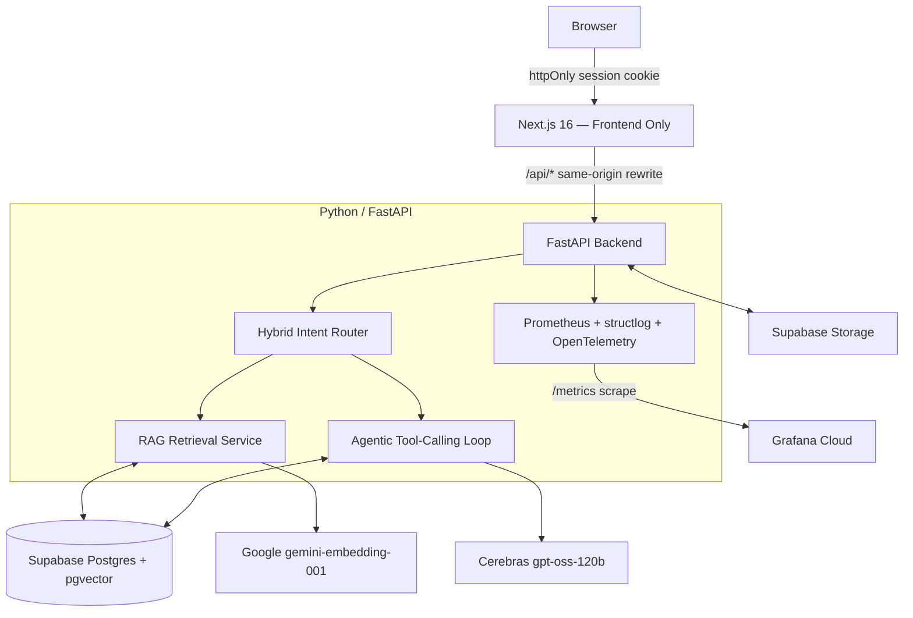
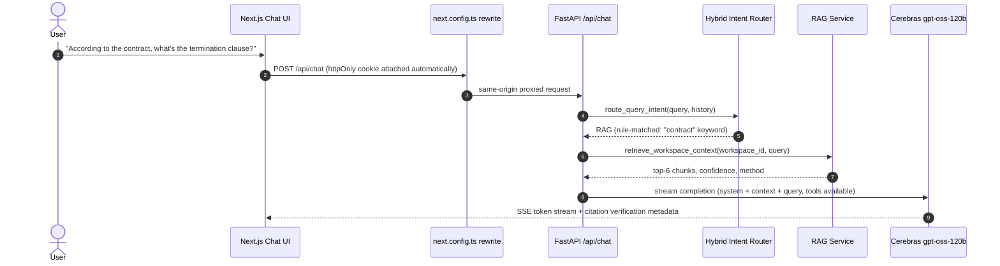

# Nexus AI — Financial Audit & M&A Data Room

A RAG (Retrieval-Augmented Generation) document assistant for M&A due diligence and financial auditing: answers grounded in uploaded deal-room documents, an agentic tool-calling workflow, and strict per-workspace data isolation.

**Architecture**: Next.js 16 frontend (Vercel) + Python/FastAPI backend (Railway/Render/Cloud Run), sharing one Supabase Postgres + pgvector database. See [`ARCHITECTURE.md`](./ARCHITECTURE.md) for the full design and [`INTERVIEW_GUIDE.md`](./INTERVIEW_GUIDE.md) for a deep walkthrough of the RAG pipeline, agentic workflow, and observability.

---

## System Architecture



## RAG + Agent Request Sequence



---

## Key Features

- **Isolated Workspaces**: documents, conversations, tasks, and vector embeddings partitioned by `workspaceId`, enforced directly in SQL `WHERE` clauses — not filtered post-query — so cross-tenant leakage is impossible even under prompt injection.
- **Hybrid RAG retrieval**: pgvector cosine search + Postgres full-text search + Levenshtein fuzzy fallback, merged, lexically reranked, diversity-selected (MMR-like), with neighbor-chunk expansion.
- **Real semantic embeddings**: Google `gemini-embedding-001` at 768 dimensions (see `INTERVIEW_GUIDE.md` §3.1 for a real bug found and fixed here during the migration).
- **Citation verification**: every RAG-grounded response is scored 0–100% "grounded" via per-sentence token-overlap against retrieved chunks — computed live, not a static label.
- **Agentic tool-calling**: 8 tools (`save_task`, `search_documents`, `create_note`, `generate_report`, `compare_documents`, `extract_data`, `run_code_sandbox`, `summarize_workspace`), each instrumented with Prometheus metrics and an audit trail (`ToolExecution` table).
- **RAG quality evaluation suite**: Precision@K and Mean Reciprocal Rank computed against live retrieval, not a synthetic benchmark.
- **Full observability**: Prometheus `/metrics`, structured JSON logs with request-ID correlation, OpenTelemetry tracing (request → RAG → LLM → agent → tool), and an importable Grafana dashboard.

---

## Tech Stack

**Frontend**: Next.js 16 (App Router, Server Components for data loading, Client Components for interactivity), Tailwind CSS, shadcn/ui, `@ai-sdk/react` for the streaming chat UI.

**Backend**: FastAPI, `asyncpg` (raw SQL, no ORM), `pydantic-settings`, `structlog`, `prometheus-client`, OpenTelemetry SDK, `python-jose` (JWT), `bcrypt`, `google-generativeai`, `cerebras_cloud_sdk`, `langchain-text-splitters`, `pypdf` / `python-docx`.

**Data**: Supabase Postgres + `pgvector`, Supabase Storage.

**LLM / Embeddings**: Cerebras Cloud (`gpt-oss-120b`), Google Generative AI (`gemini-embedding-001`).

**Observability**: Prometheus-compatible `/metrics`, Grafana Cloud (or any Prometheus-compatible managed service — no local Docker/Prometheus required), OpenTelemetry.

---

## Running Locally (no Docker required)

Two processes: the FastAPI backend and the Next.js frontend. Both connect to the same cloud Supabase Postgres instance — there's no local database to stand up.

### 1. Backend

```bash
cd backend
python -m venv .venv
.venv/Scripts/activate        # Windows; use `source .venv/bin/activate` on macOS/Linux
pip install -r requirements.txt
cp .env.example .env          # fill in DATABASE_URL, CEREBRAS_API_KEY, etc.
uvicorn app.main:app --reload --port 8000
```

Verify: `curl http://127.0.0.1:8000/health` and `curl http://127.0.0.1:8000/health/db` (confirms live DB connectivity).

### 2. Frontend

```bash
npm install
echo 'BACKEND_API_URL="http://127.0.0.1:8000"' >> .env.local
npm run dev
```

Open `http://localhost:3000`. `next.config.ts` proxies all `/api/*` requests to the FastAPI backend as a same-origin rewrite — no CORS configuration needed for the browser.

### 3. Run backend tests

```bash
cd backend
.venv/Scripts/python.exe -m pytest tests/ -v
```

---

## Deployment

- **Frontend** → Vercel. Set `BACKEND_API_URL` to the deployed backend's URL.
- **Backend** → Railway / Render / Google Cloud Run (any container or Python-buildpack host works — `uvicorn app.main:app --host 0.0.0.0 --port $PORT`). Set all vars from `backend/.env.example`.
- **Observability** → point `OTEL_EXPORTER_OTLP_ENDPOINT` at a Grafana Cloud (or other OTLP-compatible) endpoint and set `OTEL_ENABLED=true`; scrape `/metrics` with Grafana Cloud's hosted Prometheus and import `backend/observability/grafana-dashboard.json`.

---

## Testing Tenant Isolation

1. Sign up and create **Workspace A**. Upload a document containing unique text (e.g. *"The secret passcode is Omega"*).
2. Ask the assistant in Workspace A: *"What is the secret passcode?"* — it answers correctly.
3. Create **Workspace B**. Ask the same question.
4. The assistant reports no matching information — the `WHERE "workspaceId" = $1` clause in the RAG SQL means Workspace B's query can never retrieve Workspace A's chunks.
