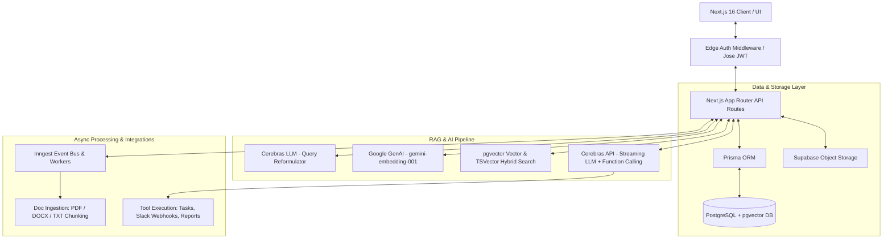
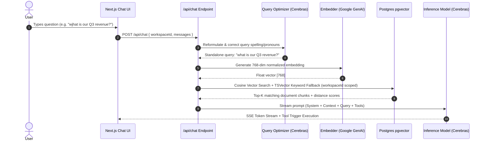

# Nexus AI - Multi-Workspace Document Assistant

A production-grade RAG (Retrieval-Augmented Generation) application with an AI assistant that answers questions grounded in uploaded workspace documents, executes autonomous tools, and guarantees strict tenant isolation.

---

## 🏗️ System Architecture



---

## ⚡ RAG Retrieval & Inference Sequence



> 📖 For a deep dive into architectural decision records (ADRs), tenant isolation proof, and quality benchmarks, see [**ARCHITECTURE.md**](./ARCHITECTURE.md).

---

## Key Features

- **Multi-Tenant Workspaces**: Workspaces isolate all documents, conversations, tasks, and vector embeddings.
- **Strict Isolation**: Single PostgreSQL vector store (`pgvector`) partitioned by `workspaceId` at the SQL query level:
  ```sql
  WHERE "workspaceId" = ${workspaceId} ORDER BY embedding <-> ${vectorStr}::vector
  ```
- **Document Ingestion Pipeline**: Auto-chunks `.pdf`, `.docx`, and `.txt` files with Google GenAI embeddings (`gemini-embedding-001`).
- **Autonomous AI Tool Executions**:
  - `save_task`: Saves specific action items directly into the workspace task board.
  - `summarize_workspace`: Multi-position document sampling & executive workspace summaries (with optional Slack webhooks).
  - `search_documents`, `create_note`, `generate_report`, `compare_documents`, `extract_data`.
- **RAG Quality Evaluation Suite**: Programmatic Precision@K, MRR (Mean Reciprocal Rank), and distance benchmarking via `/api/rag/eval`.
- **Custom JWT Auth System**: Bypasses external provider rate limits using `jose` & `bcryptjs` for unrestricted end-to-end automated Playwright testing.

---

## Tech Stack

- **Framework**: Next.js 16 (App Router)
- **Database**: PostgreSQL with `pgvector` (Supabase / Docker Postgres)
- **File Storage**: Supabase Storage
- **ORM**: Prisma
- **LLM Engine**: Cerebras Cloud (`gpt-oss-120b`) / Gemini 2.5 Flash
- **Embeddings**: Google Generative AI Embeddings (`gemini-embedding-001`)
- **Queue / Async Jobs**: Inngest
- **UI**: Tailwind CSS, shadcn/ui, Framer Motion, Recharts
- **Testing & Benchmarks**: Playwright, RAG Eval Suite

---

## Running Locally

### Option 1: Using Docker (Recommended for instant setup)

1. **Clone & install:**
   ```bash
   git clone https://github.com/premhagargi/nexus-ai.git
   cd nexus-ai
   npm install
   ```

2. **Start PostgreSQL + pgvector container:**
   ```bash
   docker-compose up -d
   ```

3. **Set up environment variables:**
   ```bash
   cp .env.example .env
   ```

4. **Run database migrations & dev server:**
   ```bash
   npx prisma db push
   npm run dev
   ```

### Option 2: Using Supabase Cloud

1. Set `DATABASE_URL` and `DIRECT_URL` in `.env` pointing to your Supabase Postgres instance.
2. Run `npx prisma db push` and `npm run dev`.

---

## Testing Tenant Isolation

1. Sign up and create **Workspace A**. Upload a document containing unique text (e.g. *"The secret passcode is Omega"*).
2. Ask the assistant in Workspace A: *"What is the secret passcode?"* (It answers correctly).
3. Create **Workspace B**. Ask the assistant: *"What is the secret passcode?"*
4. The assistant declines or reports no matching information, proving strict tenant isolation at the vector database level.
